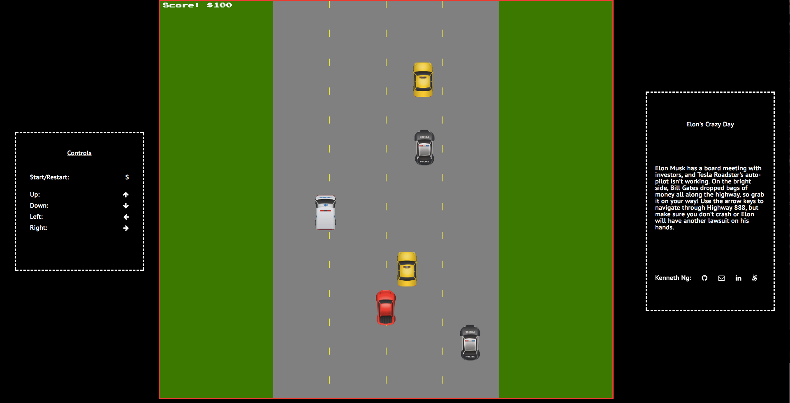

# Elon's Crazy Day!

[Play here][link]

[link]: http://kennethcng/github.io/Elon-s-Crazy-Day/

## Background

Elon Musk has a board meeting with investors, and Tesla Roadster's auto-pilot isn't working. On the bright side, Bill Gates dropped bags of money all along the highway, so grab it on your way! Use the arrow keys to navigate through Highway 888, but make sure you don't crash or Elon will have another lawsuit on his hands.

## How To Play

Press S to start/restart the game. Move around using the arrow keys.

## Features

### Rendering and Sprites

This game utilizes JavaScript and HTML5 Canvas to draw the game. There are actually two layers of Canvas, one for the background, and another for the cars and money bags. By separating the responsibilities of the two, it simplifies the drawing of the sprites by ensuring the background is always in the back.
